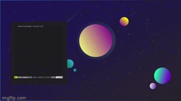

[](https://github.com/jszczerbinsky/lwp/releases/latest)

<a href="https://www.buymeacoffee.com/jszczerbinsky" target="_blank"></a>

# LWP - Layered WallPaper Engine
Lwp allows You to set multi-layered wallpapers. Each of those layers will move with Your mouse cursor, creating this beautiful visual effect:



## Building from source

<details>
<summary>Linux</summary>
<br>

- Install `SDL2` using Your package manager
- Clone the repository and install `lwp`:

```shell
git clone https://github.com/jszczerbinsky/lwp
cd lwp
make
sudo make install
```

</details>
<details>
<summary>Windows</summary>
<br>

- You need `MinGW` installed

```shell
git clone https://github.com/jszczerbinsky/lwp
cd lwp
build.bat
```

- Copy lwp.exe to desired path

</details>

## Installing

- Download `.zip` package from 
- Unpack the package to desired location

## Usage
<details>
<summary>Linux</summary>
<br>
Make sure there is no other wallpaper engine running (e.g. `feh`)<br>
Install <code>SDL2</code><br><br>

```shell
lwp [layers count] [wallpepr dir] [x] [y] [width] [height]
```
You can run `lwp` on multiple monitors by appending `[x] [y] [width] [height]` for each monitor at the end of the line

- Use this line to test lwp (replace "1920" and "1080" with Your screen resolution):

```shell
lwp 3 /usr/share/lwp/wallpapers/test 0 0 1920 1080
```
</details>
<details>
<summary>Windows</summary>
<br>

```shell
path\to\lwp\lwp.exe [layers count] [wallpepr dir] [x] [y] [width] [height]
```
You can run `lwp` on multiple monitors by appending `[x] [y] [width] [height]` for each monitor at the end of the line

- Use this line to test lwp (replace "1920" and "1080" with Your screen resolution):

```shell
path\to\lwp\lwp.exe 3 path\to\lwp\wallpapers\test 0 0 1920 1080
```

If You are using DPI scaling, go to 
`lwp.exe's properties` -> `compatibility` -> `change high DPI settings` and set both checkboxes to true
</details>


## Creating wallpapers for lwp
- Create a directory for the wallpaper
- Save each layer as: `1.bmp`, `2.bmp`, `3.bmp`... (`1.bmp` is bottom most layer)
